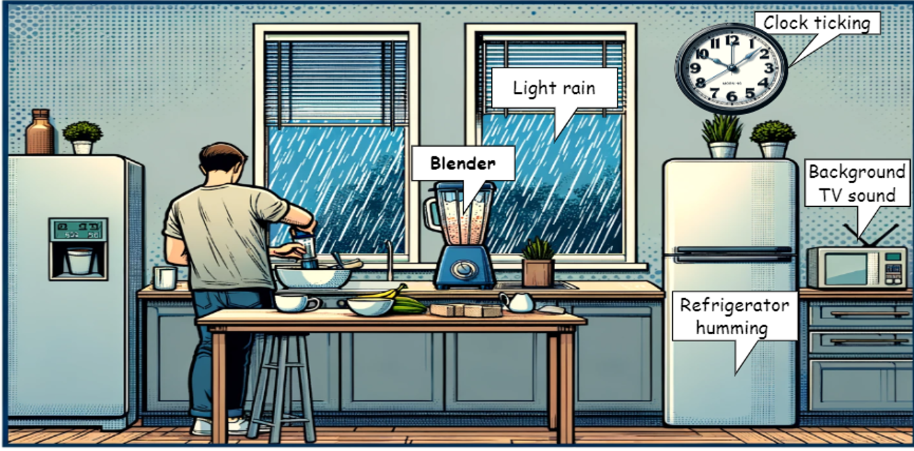

[](https://github.com/y2l/meta-transfer-learning-tensorflow/blob/master/LICENSE)
## WildDESED: A LLM-Powered Dataset for Wild Domestic Environment Sound Event Detection
Welcome to the WildDESED dataset repository! This dataset is designed to advance research in sound event detection (SED) within the challenging and diverse acoustic environments of domestic settings.
## Overview
WildDESED is an extension of the original [DESED dataset](https://project.inria.fr/desed/), created to reflect a wider variety of domestic scenarios by incorporating complex and unpredictable background noises. These enhancements make WildDESED a powerful resource for developing and evaluating noise-robust SED systems.

## Key Features
- Diverse Scenarios: The dataset includes eight domestic scenarios such as "Morning Routine" and "Home Office," designed using large language models (LLMs) to ensure realism.
- Rich Acoustic Variety: Background noises include bird chirping, car passing by, fan noise, and many more, integrated to simulate real-life domestic environments.

## Dataset Structure
The WildDESED dataset is organized into the following subsets same as the original DESED dataset:

1. Synth Training Set: 10,000 synthetic recordings with strong annotations.
2. Synth Validation Set: 2,500 synthetic recordings for model validation.
3. Weak Set: 1,578 real recordings with weak annotations.
4. Unlabeled Training Set: 14,412 real, unlabeled recordings.
5. Test Set: 1,168 real recordings with strong annotations.

## Noise Types and Scenarios
The dataset includes a variety of noise types categorized into four groups based on their acoustic characteristics:

1. Ambient Environmental Sounds: Continuous background noises like light rain and wind blowing.
2. Human-Related Sounds: Sporadic sounds such as footsteps and door closing.
3. Mechanical Sounds: Noises like clock ticking and coffee machine operation.
4. Nature and Outdoor Sounds: External noises including bird chirping and car passing by.

Each scenario combines these noises with target sound classes from the DESED dataset, ensuring that the resulting soundscapes are both realistic and challenging for SED systems.

## Scenario Examples
Here are visual representations of two different scenarios:

| Morning Routine | Pet Care |
|-----------------|-------------|
|  |  |

## Dataset Download
The dataset is available for download here (We will upload it to zenodo after the proceeding). Please ensure to read and comply with the dataset's licensing terms before use.

## Citation
If you use WildDESED dataset in your research, please cite our paper:
Y. Xiao and R. K. Das, "WildDESED: An LLM-Powered Dataset for Wild Domestic Environment Sound Event Detection System", in Proceedings of the Detection and Classification of Acoustic Scenes and Events 2024 Workshop (DCASE2024), 2024.

```bibtex
@inproceedings{Xiao2024WildDESED,
  title={WildDESED: An LLM-Powered Dataset for Wild Domestic Environment Sound Event Detection System},
  author={Yang Xiao and Rohan Kumar Das},
  booktitle={Proceedings of the Detection and Classification of Acoustic Scenes and Events 2024 Workshop (DCASE2024)},
  year={2024},
}

```
## 
## Contributing
We welcome contributions to the WildDESED dataset! Please open an issue or submit a pull request if you have suggestions or improvements. You can also [send me an email](mailto:yxiao009+github@e.ntu.edu.sg). 

## License
This dataset is based on the [AudioSet](https://research.google.com/audioset/index.html) provided by Google Inc. under the [CC BY 4.0 license](https://creativecommons.org/licenses/by/4.0/), which has been modified by Yang Xiao. The modifications include the addition of noise to the DESED dataset to create a distinct dataset. 

## References
[1] N. Turpault, et al. "Sound event detection in domestic environments with weakly labeled data and soundscape synthesis", (DCASE 2019 Workshop). 

[2] J. F. Gemmeke, et al. "Audio Set: An Ontology and Human-Labeled Dataset for Audio Events", (ICASSP 2017).
